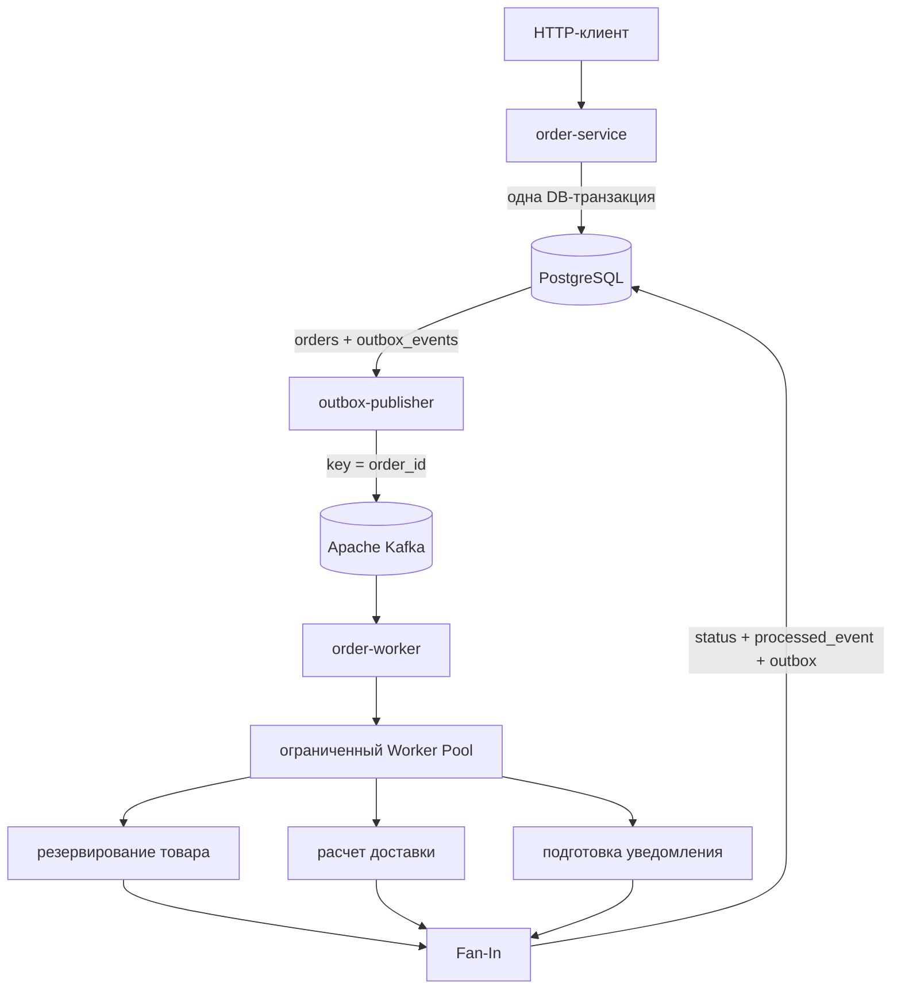

# wb-orders

Приближенный к production event-driven backend для обработки заказов маркетплейса, написанный на Go. Проект демонстрирует осознанное применение транзакций PostgreSQL, Apache Kafka, паттерна Transactional Outbox, идемпотентных потребителей, ограниченного параллелизма, Worker Pool, Fan-Out/Fan-In, retry/DLQ, graceful shutdown, наблюдаемости, Docker, Kubernetes и GitLab CI/CD.

Проект создан [eztwokey](https://github.com/eztwokey) для портфолио после изучения Go backend-разработки и паттернов конкурентного программирования в WB Tech School. Цель проекта — не собрать как можно больше технологий, а явно показать границы консистентности, семантику доставки и восстановление после сбоев.

> **Важно:** это независимый учебный проект. Он не является официальным сервисом Wildberries, не связан с внутренними системами компании и не одобрен Wildberries.

Базовое окружение: Go 1.26, PostgreSQL 17 и Apache Kafka 4.2 в режиме KRaft для локальной разработки.

Система использует семантику доставки **at-least-once**. Повторная доставка сообщений ожидаема и явно обрабатывается. Проект не заявляет о «магической» сквозной exactly-once семантике.

## Предметная область

Первая версия намеренно моделирует небольшой aggregate заказа:

- каждый заказ принадлежит покупателю и одному складу исполнения;
- цены и итоговая сумма хранятся целыми числами в копейках;
- явно поддерживается валюта `RUB`;
- резервирование товара, расчет доставки и подготовка уведомления реализованы как внутренние операции;
- Kafka topics используют namespace `wb.orders.*`;
- PostgreSQL является источником истины о текущем состоянии заказа.

Inventory, delivery и notification — контролируемые in-process компоненты, а не искусственные микросервисы. Их границы явно определены и покрыты тестами, поэтому позже их можно заменить реальными интеграциями без изменения основной модели надежности.

## Архитектура



Система состоит из трех независимо запускаемых Go-приложений, а не из набора искусственных микросервисов:

| Приложение | Ответственность |
| --- | --- |
| `order-service` | REST API, валидация, чтение заказов, атомарное создание заказа и Outbox-события |
| `outbox-publisher` | Захват неопубликованных событий по lease, ограниченная конкурентная публикация в Kafka, retry с backoff |
| `order-worker` | Чтение Kafka, идемпотентность, обработка batch через Worker Pool, Fan-Out/Fan-In, retry и DLQ |

PostgreSQL хранит актуальное состояние. Kafka переносит неизменяемые события и не заменяет хранилище текущего состояния заказа.

## Поток данных

### Создание заказа

1. `POST /api/v1/orders` проверяет покупателя, склад исполнения и позиции, затем рассчитывает итоговую сумму в копейках.
2. `order-service` создает envelope события `OrderCreated`.
3. Одна транзакция PostgreSQL записывает `orders`, `order_items` и `outbox_events`.
4. API возвращает `201 Created` только после успешного commit в PostgreSQL. HTTP-запрос не ожидает Kafka.
5. `outbox-publisher` забирает строку Outbox и публикует ее в `wb.orders.created`, используя `order_id` как Kafka key.

Одна атомарная DB-транзакция устраняет классическое окно dual write, в котором заказ уже сохранен, а соответствующее событие потеряно.

### Публикация Outbox

Publishers захватывают события запросом с `FOR UPDATE SKIP LOCKED` и назначают временный lease через `locked_by` и `locked_until`. Захват выполняется коротким SQL-запросом: открытая транзакция PostgreSQL не удерживается во время сетевого обращения к Kafka.

Продолжительность lease проверяется относительно размера batch, количества workers и timeout операций Kafka/БД. При значениях по умолчанию — `50` строк и `4` workers — lease равен четырем минутам. Поэтому событие, ожидающее своей очереди внутри локального Worker Pool, не должно быть преждевременно перехвачено другим pod.

Структурно поврежденные или противоречивые Outbox-строки переходят в терминальный статус `FAILED`, чтобы не повторяться бесконечно как poison events.

Несколько workers и pods могут публиковать события одновременно: заблокированные строки пропускаются благодаря `SKIP LOCKED`. Если publisher аварийно завершился, его lease истечет, после чего строку сможет забрать другой экземпляр.

Публикация намеренно имеет семантику at-least-once. Если Kafka уже приняла событие, но publisher завершился до установки `published_at`, событие с тем же `event_id` будет отправлено повторно.

### Обработка события

1. `order-worker` получает из Kafka конечный batch сообщений.
2. Ограниченный Worker Pool обрабатывает записи конкурентно.
3. Consumer выполняет раннюю проверку `processed_events`, чтобы не повторять заведомо лишнюю работу.
4. Резервирование товара, расчет доставки и подготовка уведомления запускаются параллельно через goroutines, общий context и буферизированный канал результатов.
5. Fan-In собирает результаты и определяет статус `CONFIRMED` или `FAILED`.
6. Короткая транзакция добавляет `processed_events`, изменяет `orders` и создает `OrderStatusChanged` в Outbox.
7. Kafka offsets подтверждаются только после того, как каждая запись batch получила долговечный результат в PostgreSQL либо была надежно опубликована в retry/DLQ topic.

Уникальный ключ `(consumer_name, event_id)` — настоящая защита от повторного бизнес-изменения. Ранняя SELECT-проверка является только оптимизацией и не используется как гарантия корректности.

Статус `PROCESSING` намеренно не сохраняется в первой версии. Если записать его заранее, авария worker может оставить заказ в зависшем состоянии и потребовать reconciliation loop. Состояние «в работе» существует внутри worker, а долговечный переход выполняется напрямую из `PENDING` в `CONFIRMED` или `FAILED` в итоговой транзакции.

## Формат события

```json
{
  "event_id": "293b7b46-69ee-4c1a-aeaf-e29e3e6d8900",
  "event_type": "OrderCreated",
  "aggregate_id": "9fea8222-07ae-4d20-a5de-4bd4ccda14fe",
  "request_id": "local-demo-1",
  "occurred_at": "2026-08-07T12:00:00Z",
  "version": 1,
  "payload": {
    "customer_id": "3f2b598f-bcaf-41f0-a4f4-7e80dc93d49a",
    "warehouse_id": "1e734f9d-1855-4b60-a428-1645946878e1",
    "currency": "RUB",
    "total_amount_minor": 229700,
    "items": []
  }
}
```

`aggregate_id` / `order_id` используется как Kafka message key. Благодаря этому события одного заказа попадают в одну partition и сохраняют порядок внутри нее. `event_id` остается неизменным при повторной доставке и используется для дедупликации. `request_id` переносится из HTTP context в envelope, Kafka headers и производные события, позволяя проследить исходный запрос через всю систему.

## Retry и DLQ

Topics:

- `wb.orders.created`;
- `wb.orders.status-changed`;
- `wb.orders.created.retry`;
- `wb.orders.created.dlq`.

При временной технической ошибке сообщение повторно публикуется в retry topic с headers `attempt`, `failure_reason`, `original_topic` и `not_before`. Задержка растет экспоненциально и ограничивается максимальным значением. После исчерпания лимита сообщение направляется в DLQ.

Невалидный JSON, неподдерживаемая версия события, поврежденные retry headers и неизвестный тип события направляются в DLQ сразу: повторная попытка не исправит их содержимое.

Retry consumer ожидает время из `not_before`. Эта намеренно простая реализация занимает один ограниченный worker slot во время ожидания. Для локальной системы и portfolio-проекта этого достаточно. Высоконагруженная production-система обычно использует несколько delay topics, отдельный scheduler или специализированный retry service.

Перемещение сообщения между topics ослабляет ordering относительно исходного topic. Поэтому transitions состояния и идемпотентность должны оставаться защитными.

## Модель конкурентности

- Публикация Outbox использует Worker Pool фиксированного размера.
- Обработка Kafka ограничена параметром `ORDER_WORKERS` и конечным размером poll batch.
- Для каждого заказа запускается фиксированный Fan-Out из трех операций и собирается ровно три результата.
- Все операции получают общий `context.Context`.
- Техническая ошибка отменяет работу соседних операций.
- Буферизированный канал не позволяет отправителям зависнуть при отмене.
- Consumer завершает весь полученный batch перед commit offsets. Это не позволяет подтвердить более высокий offset, пока более низкий offset той же partition еще обрабатывается.

Проверка конкурентного кода race detector:

```bash
make test-race
```

## Локальный запуск

Для обычного запуска нужны Docker с Compose и GNU Make.

Для Windows 11 подготовлена отдельная PowerShell-инструкция, которая не требует локальной установки Go и GNU Make: [`WINDOWS_11_RUNBOOK_RU.md`](WINDOWS_11_RUNBOOK_RU.md).

```bash
make up
make logs
```

Доступные endpoints:

| Компонент | Адрес |
| --- | --- |
| Order API | `http://localhost:8080` |
| Outbox health/metrics | `http://localhost:8081` |
| Worker health/metrics | `http://localhost:8082` |
| PostgreSQL | `localhost:5432` |
| Внешний listener Kafka | `localhost:29092` |

Создание заказа:

```bash
curl -i http://localhost:8080/api/v1/orders \
  -H 'Content-Type: application/json' \
  -H 'X-Request-ID: local-demo-1' \
  -d '{
    "customer_id":"3f2b598f-bcaf-41f0-a4f4-7e80dc93d49a",
    "warehouse_id":"1e734f9d-1855-4b60-a428-1645946878e1",
    "items":[
      {"sku":"keyboard-01","quantity":1,"unit_price_minor":129900},
      {"sku":"mouse-01","quantity":2,"unit_price_minor":49900}
    ]
  }'
```

Получение заказа по ID из ответа:

```bash
curl http://localhost:8080/api/v1/orders/ORDER_ID
```

Первый ответ обычно содержит `PENDING`. После асинхронной обработки статус изменится на `CONFIRMED` или `FAILED`.

### Сценарии для демонстрации проекта

1. **Успешная обработка:** создать заказ с количеством не более 100 единиц для каждого SKU и увидеть переход `PENDING → CONFIRMED`.
2. **Бизнес-отказ:** указать количество 101 и получить долговечный статус `FAILED` без технического retry.
3. **Недоступность Kafka:** остановить Kafka, создать заказ, увидеть накопившуюся Outbox-строку, вернуть Kafka и дождаться автоматической доставки.
4. **Повторная доставка:** повторно доставить сообщение с тем же `event_id` и убедиться, что `processed_events` превращает второе DB-изменение в no-op.

Точные PowerShell-команды для первых трех сценариев находятся в Windows runbook.

Остановка контейнеров без удаления данных PostgreSQL:

```bash
make down
```

## Команды разработки

```bash
make fmt
make vet
make test
make test-race
make build
```

Для integration tests нужны PostgreSQL с примененными migrations и Kafka broker:

```bash
make integration-up
make test-integration
```

`integration-up` намеренно запускает только PostgreSQL и Kafka без application containers. Иначе работающий Outbox Publisher мог бы забрать тестовую строку и создать гонку с repository integration test.

Kafka integration test публикует событие в уникальный временный topic и проверяет aggregate key, envelope и correlation headers.

OpenAPI-спецификация: [`api/openapi.yaml`](api/openapi.yaml).

## Ограничения и индексы PostgreSQL

- `orders.id` — primary key aggregate заказа.
- Каждый заказ имеет обязательный `warehouse_id`; индекс по warehouse/status поддерживает запросы обработки склада.
- `order_items` использует составной primary key `(order_id, sku)` и запрещает повторение SKU внутри одного заказа.
- Деньги хранятся как положительный `BIGINT` в копейках, а не `float64`; схема первой версии разрешает только `RUB`.
- Partial index доступности Outbox содержит только неопубликованные строки.
- Индексы истекших leases и aggregate ID ускоряют восстановление и поиск событий заказа.
- `processed_events` использует `(consumer_name, event_id)`, поэтому разные логические consumers могут независимо обработать одно событие.
- Поврежденные Outbox-строки получают терминальный статус `FAILED` и исключаются из обычного claim и pending metric.
- Статусы представлены enum-типами PostgreSQL, а переходы проверяются доменной логикой.

Все изменения схемы выполняются через версионированные forward/down migrations.

## Сценарии отказа

| Точка отказа | Поведение системы |
| --- | --- |
| PostgreSQL недоступна во время `POST` | API возвращает ошибку; ни заказ, ни Outbox-строка не сохраняются |
| Ошибка между insert заказа и Outbox | PostgreSQL откатывает всю транзакцию |
| Kafka недоступна | Новые заказы продолжают приниматься; Outbox накапливается и повторяет попытки |
| Publisher завершился до publish | Lease истекает; событие забирает другой worker |
| Publisher завершился после publish, но до DB mark | Событие публикуется повторно с тем же `event_id` |
| Outbox payload поврежден или противоречив | Строка получает `FAILED` и остается для анализа оператором |
| Consumer получил duplicate | Уникальный ключ `processed_events` превращает его в no-op |
| Consumer завершился до DB commit | Транзакция откатывается, Kafka доставляет сообщение повторно |
| Consumer завершился после DB commit, но до offset commit | Kafka повторяет доставку, идемпотентность предотвращает повторное изменение |
| Retry publish успешен, но commit исходного offset не выполнен | Retry-сообщение может продублироваться; стабильный `event_id` делает это безопасным |
| Версия или структура события не поддерживается | Сообщение отправляется в DLQ с описанием причины |
| Одна операция Fan-Out вернула техническую ошибку | Общий context отменяет соседние операции; событие направляется в retry |
| Обязательная бизнес-операция отклонила заказ | Заказ получает `FAILED`; технический retry не выполняется |
| Pod получил SIGTERM | Новая работа прекращается, текущая получает cancellation, HTTP-серверы закрываются в пределах grace period |
| Outbox растет быстрее публикации | Backlog виден через metric `wb_orders_outbox_pending` и может использоваться для alert/scaling |

### Внешние side effects

Таблица `processed_events` не может сделать произвольный HTTP-вызов или отправку email атомарными с PostgreSQL. Текущий notification-компонент только **подготавливает** уведомление.

Реальная отправка уведомления должна быть отдельным Outbox-событием, которое обрабатывает компонент со своим idempotency key. Эта граница оставлена намеренно.

## Observability

Все приложения, включая startup error paths, выводят структурированные JSON logs. Исходный `request_id`, стабильный `event_id` и `order_id` переносятся через event envelope и Kafka headers и добавляются в logs обработки события.

Prometheus metrics доступны по `/metrics`:

- количество и длительность HTTP-запросов;
- результаты публикации Outbox и размер pending backlog;
- результаты обработки Kafka-сообщений;
- длительность обработки заказа.

OpenTelemetry tracing оставлен дальнейшим улучшением. Его добавление сейчас не изменило бы основную модель надежности проекта.

## Kubernetes

В `deploy/k8s` находятся:

- Namespace;
- ConfigMap;
- пример Secret без настоящих credentials;
- migration Job;
- три Deployments;
- Service для HTTP API;
- readiness и liveness probes;
- resource requests/limits;
- termination grace periods.

Перед deployment нужно создать Secret:

```bash
cp deploy/k8s/secret.example /tmp/wb-orders-secret.yaml
# замените placeholder локально, затем:
kubectl apply -f /tmp/wb-orders-secret.yaml
```

Для скачивания образов из GitLab Registry создается image pull secret на основе долгоживущего GitLab deploy token с правом `read_registry`. Короткоживущий CI job token для этого использовать не следует:

```bash
kubectl -n wb-orders create secret docker-registry gitlab-registry \
  --docker-server=registry.gitlab.com \
  --docker-username=DEPLOY_TOKEN_USER \
  --docker-password=DEPLOY_TOKEN_PASSWORD
```

PostgreSQL и Kafka считаются внешними управляемыми зависимостями staging-окружения. Пример адреса Kafka в ConfigMap необходимо заменить на адрес целевого кластера.

## GitLab CI/CD

Этот репозиторий публикуется на GitHub как публичная витрина портфолио. Pipeline намеренно остается в `.gitlab-ci.yml`: после импорта или зеркалирования репозитория в GitLab активируется требуемый GitLab CI/CD workflow. GitHub Actions не добавляется как вторая дублирующая CI-система.

Pipeline:

```text
lint → test → build → docker → deploy
```

Для Merge Requests выполняются:

- проверка `gofmt` и актуальности `go.mod`/`go.sum`;
- `go vet`;
- `golangci-lint`;
- unit tests;
- PostgreSQL и Kafka integration tests;
- race detector для concurrency-sensitive пакетов.

Branch pipelines собирают бинарники и Docker images с тегом commit SHA. Для default branch дополнительно публикуется `latest`. Staging deployment сначала применяет migrations, затем устанавливает три образа по immutable SHA и ожидает завершения rollout.

Необходимые protected CI variables и cluster resources:

- стандартные переменные GitLab Container Registry;
- `KUBE_CONFIG` с kubeconfig в Base64;
- Kubernetes Secret `wb-orders-secret`, созданный вне репозитория;
- image pull Secret `gitlab-registry`, созданный из read-only GitLab deploy token.

## Структура репозитория

```text
cmd/                    точки сборки трех приложений
internal/order/         доменная модель заказа, HTTP API и PostgreSQL adapter
internal/outbox/        захват и публикация Transactional Outbox
internal/consumer/      идемпотентная Kafka-обработка, retry и DLQ
internal/processing/    Fan-Out/Fan-In pipeline одного заказа
internal/workerpool/    generic Worker Pool для конечного batch
internal/platform/      config, DB, Kafka, logs, metrics, health, shutdown
migrations/             версионированная схема PostgreSQL
api/                    OpenAPI-спецификация
deploy/k8s/             Kubernetes manifests
docs/adr/               Architecture Decision Records
docker/                 runtime и migration images
```

## Архитектурные решения

Основные решения зафиксированы в [`docs/adr`](docs/adr):

1. три запускаемых приложения и одна общая база PostgreSQL;
2. Transactional Outbox с lease-based claiming;
3. at-least-once delivery и идемпотентные consumers;
4. ограниченная конкурентность, Worker Pool и Fan-Out/Fan-In;
5. retry topics и DLQ;
6. graceful shutdown и batch commit Kafka offsets;
7. marketplace scope, fulfillment warehouse и денежная модель `RUB`.

Каждый ADR описывает не только выбранное решение, но и его контекст, последствия и ограничения.

## Осознанно исключено из первой версии

- интерфейс для каждой структуры только ради формальной «чистой архитектуры»;
- тяжелый dependency injection framework;
- distributed transactions;
- заявление о сквозной exactly-once семантике;
- отдельный микросервис для каждой внутренней операции;
- внешний inventory/email side effect без настоящего idempotency contract.

## Возможные следующие шаги

- HTTP idempotency key для повторных клиентских запросов;
- управляемая команда replay для DLQ и терминальных Outbox-строк;
- retention jobs для опубликованного Outbox и истории `processed_events`;
- интеграция с реальным складом с собственным idempotency contract;
- развитие event schema после версии 1;
- OpenTelemetry tracing после стабилизации основной модели надежности.

## Публикация проекта

Пошаговая инструкция загрузки проекта в GitHub с Windows 11 находится в [`GITHUB_PUBLISH_RU.md`](GITHUB_PUBLISH_RU.md).
