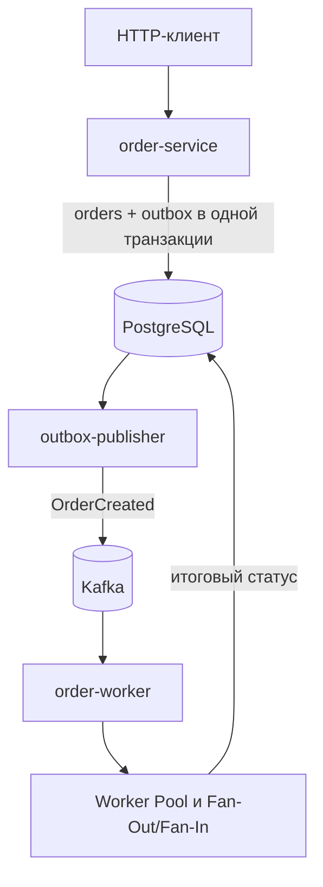

# wb-orders

`wb-orders` — мой учебный backend-сервис для обработки заказов маркетплейса.

## Архитектура

В проекте три Go-приложения:

| Приложение | Задача |
| --- | --- |
| `order-service` | REST API, валидация, создание и получение заказов |
| `outbox-publisher` | Чтение событий из PostgreSQL и публикация в Kafka |
| `order-worker` | Обработка Kafka-событий, изменение статуса заказа |



PostgreSQL является источником текущего состояния заказа. Kafka используется для доставки событий между компонентами.

## Как работает проект

### Создание заказа

Клиент отправляет `POST /api/v1/orders`. `order-service` проверяет данные и в одной транзакции PostgreSQL создает:

- заказ и его позиции;
- событие `OrderCreated` в таблице `outbox_events`.

Сервис не отправляет событие в Kafka напрямую. Если транзакция откатится, не сохранится ни заказ, ни событие. Если commit прошел успешно, событие гарантированно остается в Outbox и может быть опубликовано позже.

### Публикация в Kafka

`outbox-publisher` забирает неопубликованные события через `FOR UPDATE SKIP LOCKED` и публикует их ограниченным Worker Pool. Поэтому несколько workers или pods могут работать параллельно, не обрабатывая одну строку одновременно.

После успешной публикации событие отмечается в PostgreSQL. Если процесс упадет после отправки в Kafka, но до обновления Outbox, сообщение будет отправлено повторно. Проект использует at-least-once delivery и не пытается выдавать ее за exactly-once.

Kafka key равен `order_id`, поэтому события одного заказа сохраняют порядок внутри partition.

### Обработка заказа

`order-worker` получает `OrderCreated` и параллельно запускает три операции:

- резервирование товара;
- расчет доставки;
- подготовку уведомления.

Fan-Out запускает операции, Fan-In собирает результаты. Количество одновременно обрабатываемых сообщений ограничено Worker Pool, а все операции поддерживают `context.Context` и отмену.

После обработки одна транзакция PostgreSQL:

1. записывает `event_id` в `processed_events`;
2. переводит заказ в `CONFIRMED` или `FAILED`;
3. создает событие `OrderStatusChanged` в Outbox.

Уникальный ключ `(consumer_name, event_id)` делает consumer идемпотентным. Повторная доставка того же события не изменит заказ второй раз.


## Быстрый запуск на Ubuntu

Клонирование и запуск проекта:

```bash
git clone https://github.com/eztwokey/wb-orders.git
cd wb-orders
docker compose up -d --build
docker compose ps
```


Проверка API:

```bash
curl -fsS http://localhost:8080/health
curl -fsS http://localhost:8080/ready
```

Создание заказа:

```bash
curl -i -X POST http://localhost:8080/api/v1/orders \
  -H 'Content-Type: application/json' \
  -H 'X-Request-ID: local-demo-1' \
  -d '{
    "customer_id": "3f2b598f-bcaf-41f0-a4f4-7e80dc93d49a",
    "warehouse_id": "1e734f9d-1855-4b60-a428-1645946878e1",
    "items": [
      {"sku": "keyboard-01", "quantity": 1, "unit_price_minor": 129900},
      {"sku": "mouse-01", "quantity": 2, "unit_price_minor": 49900}
    ]
  }'
```

Скопировать `id` заказа из ответа и через несколько секунд проверить статус:

```bash
curl -fsS http://localhost:8080/api/v1/orders/ORDER_ID
```

Сначала заказ создается в статусе `PENDING`, затем переходит в `CONFIRMED` или `FAILED`.

Логи и остановка проекта:

```bash
docker compose logs -f
docker compose down
```

## Тесты

Если Go установлен локально:

```bash
go test ./...
go test -race ./...
```

Запуск тестов через Docker:

```bash
docker run --rm -v "$(pwd):/app" -w /app golang:1.26 go test ./...
docker run --rm -v "$(pwd):/app" -w /app golang:1.26 go test -race ./...
```

В проекте также есть structured JSON logs, Prometheus-метрики, health/readiness endpoints и graceful shutdown по `SIGTERM`/`SIGINT`.
